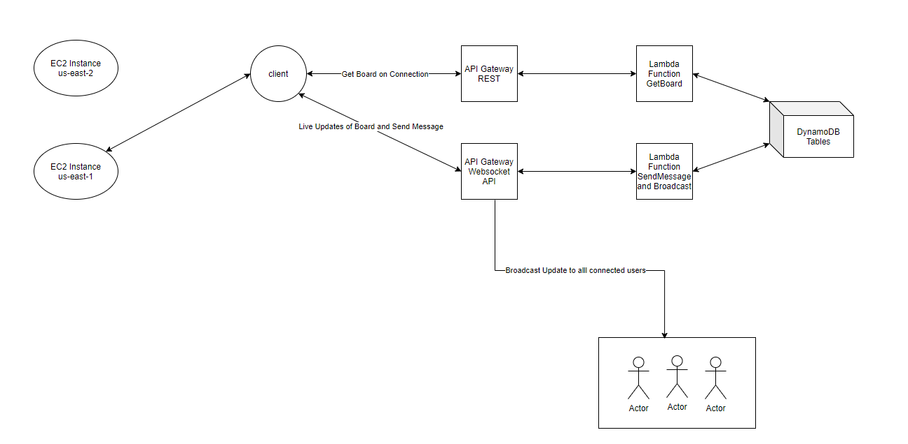

# Author

- Ayush  Parikh
  - email: ayush.parikh@mail.utoronto.ca
  - utorid: parikhay
- Malay Shah
  - email: malay.shah@mail.utoronto.ca
  - utorid: shahmal3
- Jefferson Zhong
  - email: jefferson.zhong@mail.utoronto.ca
  - utorid: zhongjef

# Overview

- "r/place" is an a giant canvas Reddit published on 2017's April fools day to test. clients can collaboratively change pixels on the canvas and ultimately create arts. Technical challenges of r/palce are widely discussed, especially on concurrency, scalability, and scalability. In this project we implement r/place using AWS services and WebSocket API achieving high concurrency, scalability, and consistency.
-  Visit [here](http://address:port) for our deployment.

# Design
A giant canvas with $1000 \times 1000$ pixels, where each pixel has its own color. The canvas is accessible publicly without the need of login, but an client can change at most $1$ pixel per every $5$ minutes.

# Architecture

Our implementation is severless. Functional services are hosted on Amazon Lambda and Database is on Amazon DynamoDB.

## Database
We are using Amazon DynamoDB as the database to store both state of the canvas and record of clients currently connecting.

### clients connecting
DynamoDB keeps a table of currently connected client's WebSocket connection ids. Upon disconnection, e.g. closing the page, clients are removed from this table. 

### State of the Canvas
DynamoDB also stores the current state of the canvas as key-value pairs (pixel, color) in a table.
  - pixel = x + 1000y, where x and y are the coordinate of the pixel on the canvas.
  - color is a string of RGB values in hex, e.g. #215B8F

## Functionality

Function services, including connection setup, canvas setup, disconnection handler, pixel update handlers, and update broadcasters are all implemented on Amazon Lambda.

**Lifecycle**:

Connection Setup -> Fetch the Canvas -> Update Pixel <-> Broadcast Update -> Disconnect

### Connection Setup
- In front end, before the page loads, a Lambda fetch canvas function is called to fetch the current state of the canvas.
- After the canvas is fetched, a WebSocket connection is initialized between the client and a Lambda onConnect function.
- In the Lambda onConnect function, the client's WebSocket connection id is stored in a DynamoDB table that keeps track of connected clients.

#### Fetch Canvas 
- An api request to fetch the current board state. Unable to do change pixel until board is generated, and all the new broadcasted requests are handled.

### Update Pixel
- An client can update single 1 pixel every 5 minutes. The update request is handled by an update hanlder in Amazon Lambda. If the 5 minutes time interval is satisfied, the hanlder will store the update into DynamoDB.    

#### Broadcasting Updates
- When a (pixel, color) entry is updated in the DynamoDB, a trigger will call a Lambda broadcasting function to broadcast the updated entry to every connected clients using WebSocket connection.

### Disconnect
- If a client disconnects from the service, their connection is removed thus no further update will be received.

# Scalability
- Both Amazon DynamoDB and Amazon lambda automatically scales.

## DynamoDB
- DynamoDB automatically spreads the data and traffic for tables over a sufficient number of servers to handle the throughput and storage requirements, while maintaining consistent and fast performance. All of the data is stored on solid-state disks (SSDs) and is automatically replicated across at least two Availability Zones in an AWS Region, providing built-in high availability and data durability.

## Lambda

### Vertical Scalability
- Every time an event notification is received for a function, AWS Lambda quickly locates free capacity within its compute fleet and runs the code.

### Horizontal Scalability
- Since the code is stateless, AWS Lambda can start as many copies of the function as needed. When the function receives a request while it's processing a previous request, Lambda launches another instance of the function to handle the increased load. Lambda automatically scales to handle 1,000 concurrent executions per Region, a quota that can be increased if needed.

# Availability
In AWS, each region is fully isolated and comprised of multiple Availability Zones, which are fully isolated partitions of the infrastructure. Lambda will run the function in multiple Availability Zones to ensure that it is available to process events in case of a service interruption in a single zone.

# Eventual Consistency
We choose Eventual Consistency as the DynamoDB's consistency model. Eventual consistency maximizes the read throughput for which is suitable for our purposes, since a client can only write to 1 pixel every 5 minutes, but can fresh to fetch entire canvas without limit. In DynamoDB, all copies of data usually reach consistency within a second. Repeating a read after a short time should return the updated data.

# Evaluation

## Strength
Our implementation automatically scales as needed by the AWS services. The Lambda functions by default automatically scales to handle up to 1000 concurrent requests and can be configured to handle more. The DynamoDB has data automatically replicated across multiple availability zones and regions, and it can support peaks of more than 20 million requests per second.

In addition, since Lambda serverless applications is charged per use, we have significantly reduced cost of execution comparing to the traditional non-severless implementation.

## Weakness

There could be potential latency issues since every pixel update requests will be shown until it is send to the Lambda hanlder, store in DynamoDB, and broadcasted to connected clients. Also, the DynamoDB used a eventual consistency model, for which can cause inconsistency between consecutive reads and writes.